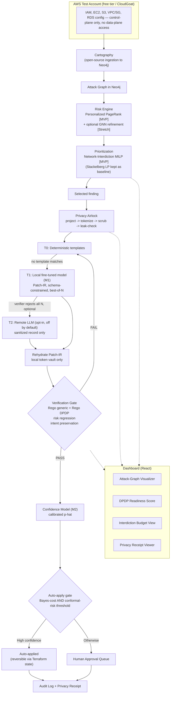

# ARGUS v3: Tiered, Privacy-First Remediation with a Learned Patch Generator
### Revising the 4–5 Month Cloud Attack-Graph Platform to Remove Its Dependency on Paid or Rate-Limited LLM APIs — and to Turn That Constraint into the Project's Strongest Novelty Claim

---

> **What this document is.** The v2 plan solved the schedule-risk problem (training a GNN from scratch, multi-cloud ingestion, multi-agent orchestration) by trading expensive components for cheap, proven ones. It left one component unsolved: remediation drafting still assumed an LLM API that behaves reliably, has generous rate limits, and can be trusted with cloud configuration data. None of that holds for a team without paid keys. This document replaces that one component — Section 9, plus the pieces of Sections 5, 7, 8, 11, 12, 13, 15 and 16 that depend on it — with a design that is simultaneously cheaper, more private, and more publishable. Everything from v2 not touched here (Cartography ingestion, PageRank risk scoring, the DPDP mapping table, the dashboard, the personas) is carried forward unchanged and is only summarized below for continuity; read v2 alongside this document for the full detail on those parts.
>
> **The core idea in one sentence:** stop treating the LLM as the thing that has to be right, and treat the verifier — which you were already building for safety reasons — as the thing that makes an imperfect, small, local, free model good enough, while a privacy airlock guarantees the model never sees anything it shouldn't in the first place.

---

## Table of Contents
1. [What Changed From v2, and Why](#1-what-changed-from-v2-and-why)
2. [Executive Summary](#2-executive-summary)
3. [Problem Statement](#3-problem-statement)
4. [Related Work — Where This Sits](#4-related-work--where-this-sits)
5. [System Architecture](#5-system-architecture)
6. [Users & Empathy Mapping](#6-users--empathy-mapping)
7. [Math & Algorithmic Foundations](#7-math--algorithmic-foundations)
8. [The DPDP Compliance Engine](#8-the-dpdp-compliance-engine)
9. [The Privacy-First, Tiered Remediation Engine](#9-the-privacy-first-tiered-remediation-engine)
10. [UI/UX — the Dashboard](#10-uiux--the-dashboard)
11. [Validation & Evaluation Plan](#11-validation--evaluation-plan)
12. [Feasibility, Team, and the Timeline](#12-feasibility-team-and-the-timeline)
13. [Novelty, Patent & Publication Strategy](#13-novelty-patent--publication-strategy)
14. [Social Impact](#14-social-impact)
15. [Scorecard Against the Rubric](#15-scorecard-against-the-rubric)
16. [Honest Limitations](#16-honest-limitations)
17. [References](#17-references)
18. [Appendix](#18-appendix)

---

## 1. What Changed From v2, and Why

Three problems with v2's remediation design, stated plainly:

1. **No paid keys, and the free tiers are worse than they look.** Google's terms state that unpaid Gemini API and AI Studio usage is used to improve Google's products and may be read by human reviewers, and explicitly ask users not to submit sensitive or confidential information to unpaid services. Mistral's generous free "Experiment" tier requires opting into data training. OpenRouter's free-model pool is capped at roughly 20 requests/minute and 50/day until the account has ever purchased credit. These aren't edge cases — they are the terms as written in 2026, and they are incompatible with a tool whose entire pitch is "we help you comply with a data-protection law."
2. **General-purpose LLMs are weak on exactly the hard cases.** Published Terraform-generation benchmarks put general models well under 30% success on realistic infrastructure-as-code tasks, and even the LLM-based remediation literature the v2 plan cites reports first-attempt deployment success in the 20–30% range. That's before rate limits force you to burn your daily quota on retries.
3. **The Bayes-cost auto-apply gate in v2 had no actual input.** It needs a calibrated confidence $\hat{p}$, and nothing in v2 produced one — it was a formula waiting for a number.

The fix is a single reframing: **generation is cheap to get wrong if verification is strong.** ARGUS already has the makings of a strong verifier — two Rego policy libraries plus a risk-regression re-score. Section 9 below builds the missing pieces around that verifier: a constrained output format the model can't get syntactically wrong, a small model that never leaves your machine, a way to manufacture training data without ever calling a paid API, and a calibrated number for the gate to actually threshold on. A privacy airlock sits in front of every tier, including the one local model, because "runs locally" isn't the same guarantee as "never sees personal data" — the two are related but distinct claims, and the paper should make both, separately, with evidence.

| Component | v2 | v3 | Why the change |
|---|---|---|---|
| Remediation drafting | One RAG-grounded LLM API call per finding | **Tiered pipeline**: deterministic templates (T0) → local fine-tuned model (T1) → optional sanitized remote LLM (T2, off by default) → human (T3) | Removes the single point of failure (rate limits, terms of service, cost) and gives the paper a real ablation ladder instead of one API call |
| Output format | Free-form JSON patch per finding | **Patch-IR**: a small, closed set of typed operations, schema-constrained at generation time | Eliminates most syntax and hallucination failure modes before the verifier even runs |
| Data sent off-device | Whatever the RAG context happened to include | **Nothing, by default.** T0/T1 run fully local. If T2 is ever enabled, only a tokenized, attribute-projected, scrubbed record leaves the machine — never raw identifiers, secrets, or data-plane content | Matches the DPDP Rule 6(1)(a) safeguard language (encryption, obfuscation, masking, virtual tokens) the project is already citing, and removes the free-tier-terms conflict entirely for the default path |
| Auto-apply confidence | Undefined $\hat p$ in a Bayes-cost formula | **Learned, calibrated confidence model (M2)**, thresholded with a conformal-risk guarantee in addition to the Bayes-cost number | Gives the gate something real to threshold on, and gives the paper a statistically defensible claim ("at most X% of auto-applied patches are wrong, with 95% confidence") instead of a formula with a made-up input |
| Prioritization | Stackelberg security game (randomized coverage) | **Network-interdiction MILP** (binary fix/no-fix, budget-constrained) as the MVP prioritizer; the original Stackelberg game kept as a labeled baseline in the comparison panel | Patches are binary decisions, not randomized strategies — interdiction is the model actually built for "which fixed set of edges most increases the attacker's cost," and it solves just as fast |
| ML story | GNN edge-weight refinement, stretch/ablation only | **Two load-bearing models**: M1 (verifier-guided remediation model) and M2 (calibrated confidence model), both MVP; GNN kept as an additional stretch ablation from v2, unchanged | This is where the "make the ML impactful" ask lives — a fine-tuned generator plus a calibrated risk-of-error model is a real, defensible ML contribution, not a bolt-on |

Everything else — Cartography, PageRank, the DPDP mapping table, the personas, the dashboard's non-remediation panels, the phased-plan discipline of MVP-vs-Stretch — is unchanged from v2 and is restated below only where it interacts with the new material.

---

## 2. Executive Summary

**ARGUS** builds a live AWS attack graph (Cartography → Neo4j), scores it with Personalized PageRank, and decides what to fix first with a budget-constrained network-interdiction model whose edge costs come from that same graph. For whatever gets selected, a **tiered remediation pipeline** produces a fix: a deterministic template first, a small model fine-tuned specifically for this task second, and — only if a human explicitly opts in per-deployment — a general remote LLM third, with a human approval queue as the final tier. Every candidate fix is expressed in a constrained intermediate representation (Patch-IR), never free-form code, and every fix — regardless of which tier produced it — must clear a verification gate before it can go anywhere near the real environment: two policy-as-code libraries (generic hygiene and India's DPDP Act Rule 6/7/8/15), a re-run of the risk model on the simulated post-patch graph, and a new intent-preservation check that blocks any patch that deletes a resource or removes an access path still in active use. A second, independently trained model produces a calibrated confidence score for each verified patch, and a conformal-risk-controlled threshold — not a hand-picked cutoff — decides auto-apply versus human review.

Underneath all of this sits a **privacy airlock**: a fixed, auditable data-flow boundary that decides, before any patch generator (including the local one) ever runs, exactly which attributes of a finding it is allowed to see. Real identifiers are replaced with structure-preserving tokens, secrets and data-plane content are never read by ARGUS at all (its IAM role has no data-plane permissions), and a final scan blocks any outbound request — even a local one — that still contains a real identifier or a detected personal-data pattern (including India-specific ones like Aadhaar and PAN numbers). Nothing is sent to any third-party model provider unless a deployer explicitly turns that tier on, and even then only the sanitized record leaves the machine.

This is buildable in 4–5 months, part-time, because the two ML components (a fine-tuned remediation model and a calibrated confidence model) share one dataset, generated entirely offline by a mutation engine that corrupts known-good Terraform configurations according to the same rules the Rego libraries check — no paid API calls anywhere in the training loop. The project's novelty claim sharpens rather than weakens under this design: instead of "an LLM drafts fixes," the claim becomes "a small, verifier-trained model plus a calibrated, provably-bounded auto-apply decision plus a measured privacy-utility trade-off," each piece independently evaluable and each piece a genuine, if modest, contribution.

---

## 3. Problem Statement

*(Carried forward from v2 without substantive change — restated briefly for continuity; see v2 §3 for full detail and citations.)*

Cloud misconfiguration remains the dominant, self-inflicted cause of cloud breaches; the average breach cost still runs into the millions; India has a measured and large gap between cybersecurity demand and supply. India's Digital Personal Data Protection Rules, 2025 were notified on 13 November 2025 and take full effect in mid-May 2027. Rule 6 sets minimum technical/organizational safeguards, Rule 7 sets a 72-hour breach notification clock, Rule 8 sets retention/erasure obligations, and Rule 15 governs cross-border transfer on a permissive, negative-list basis rather than a blanket localization mandate — a tool that flags every non-Indian region as a violation would be wrong, and ARGUS treats Rule 15 as a visibility feature accordingly.

**New to v3:** the same DPDP Rule 6(1)(a) language the project already cites as its compliance target — *"appropriate data security measures, such as securing of personal data through encryption, obfuscation, masking or the use of virtual tokens mapped to that personal data"* — is also the design spec for how ARGUS must treat its own telemetry before showing it to any model, local or remote. A tool that tells organizations to tokenize personal data while sending its own users' cloud metadata to an unpaid, terms-of-service-ambiguous third-party API would be a credibility problem in the paper, not just an engineering one. v3 closes that gap by construction.

---

## 4. Related Work — Where This Sits

The commercial and academic landscape from v2 §4 is unchanged (CNAPP vendors, GDPR/SOC2-focused compliance automation tools, graph-based cloud threat modeling, Stackelberg-game security literature, LLM-based IaC repair as a live but separate thread). Three additions specific to v3:

- **TerraFormer** (ICSE 2026) is the closest published system to ARGUS's new remediation approach: it fine-tunes a language model for Terraform generation and mutation using supervised fine-tuning followed by verifier-guided reinforcement learning, and reports that the resulting small model outperforms general-purpose models roughly 50× its size on its benchmarks. This is important prior art and should be cited honestly as validation of the *recipe* (SFT → verifier-guided refinement beats scale for narrow IaC tasks), not treated as ARGUS's own idea. ARGUS's contribution is applying that recipe to *finding-driven repair scored by security effect and mapped to a named national law*, with a measured privacy layer in front of it — none of which TerraFormer addresses.
- **Presidio** (Microsoft, open-source, MIT-licensed) is the standard toolkit for detecting and de-identifying personal data in text, runs fully offline, and has community-contributed recognizers for India-specific identifiers (Aadhaar, PAN) — this is the base the privacy airlock's scrubbing layer builds on rather than reinventing.
- **Conformal risk control / selective conformal prediction** (Angelopoulos et al.; Jin & Candès) gives a way to pick a decision threshold with a finite-sample, distribution-free guarantee on the error rate of the *selected* subset — exactly the property the auto-apply gate needs and that a hand-picked Bayes-cost cutoff alone does not provide. This is a genuinely underused tool in the cloud-security-automation literature, which is where a modest but real piece of ARGUS's novelty sits.

Nothing in the reviewed landscape combines a live cloud attack graph's risk output, a network-interdiction prioritizer, a verifier-trained *local* remediation model with a privacy-preserving input boundary, and a conformal-calibrated auto-apply decision, mapped throughout to India's DPDP Rules. That combination — not any single piece of it — is the claim.

---

## 5. System Architecture



**Stack additions over v2:** Ollama or llama.cpp for local model serving with JSON-schema-constrained decoding; Unsloth for fine-tuning (LoRA/QLoRA on free Colab/Kaggle GPUs); Microsoft Presidio (plus community India-locale recognizers) for the scrubbing layer; a small local key-value store (SQLite, encrypted at rest) for the tokenization vault; scikit-learn or LightGBM for the confidence model M2; PuLP or OR-Tools for the interdiction MILP (same libraries as v2's LP, different formulation). Everything in this list is free and runs on a laptop; nothing here requires a paid API key. T2, if a deployer turns it on, is the only component that talks to the outside world for remediation purposes.

---

## 6. Users & Empathy Mapping

Unchanged from v2 §6. One addition: **Meenal** (the compliance persona) now also cares about a fourth answer — "what did the AI actually see when it drafted this fix?" — which the privacy receipt (§9.3, §10) exists specifically to give her, in the same rule-citing, drill-down style as the DPDP readiness score.

---

## 7. Math & Algorithmic Foundations

### 7.1 Attack graph formalism **[MVP — unchanged from v2 §7.1]**

$G_t = (V_t, E_t, \tau_V, \tau_E, X_t)$, a typed directed graph close to Cartography's native schema. See v2 for the full node/edge type list.

### 7.2 Risk propagation **[MVP — unchanged from v2 §7.2]**

Personalized PageRank over heuristically-weighted edges:

$$\boldsymbol{\pi} = c\, M^\top \boldsymbol{\pi} + (1-c)\, \mathbf{e}_S$$

### 7.3 Optional GNN layer **[Stretch — unchanged from v2 §7.3]**

A small GraphSAGE/GAT model refining edge weights, evaluated as an ablation against the PageRank baseline. Not load-bearing.

### 7.4 Prioritization: network interdiction, not a security game **[MVP — revised]**

v2 modeled prioritization as a Stackelberg security game with randomized defender coverage $x_i \in [0,1]$. That formulation is built for problems where the defender's real move is a probability of inspection or patrol — it is the right tool when coverage is inherently randomized (airport checkpoints, patrol routes). Patching a misconfiguration is not randomized: a finding is either fixed or it isn't. Representing it as a fractional $x_i$ produces a number with no operational meaning (what does "68% coverage" mean for an S3 bucket?), and a reviewer familiar with the security-games literature will notice the mismatch immediately.

The right model for "which fixed set of binary actions, under a budget, most increases an attacker's cost to reach a target" is **network interdiction**. Formulated as the dual of a shortest-path problem (the standard Israeli–Wood approach), with edge length $d_{ij} = -\log p_{ij}$ (so path length is negative log attacker-success-probability, and a longer path is a harder one):

$$\max_{\boldsymbol{\pi},\,\mathbf{x}} \ \pi_t - \pi_s$$
$$\text{s.t.} \quad \pi_j - \pi_i \le d_{ij} + \Delta_{ij}\, x_{ij} \quad \forall (i,j) \in E$$
$$\sum_{ij} c_{ij}\, x_{ij} \le B, \qquad x_{ij} \in \{0,1\}$$

where $s$ is a super-source over public-facing entry points, $t$ is a super-sink over crown-jewel assets, $x_{ij}=1$ means "apply the fix that hardens edge $(i,j)$," $\Delta_{ij}$ is how much that fix increases the edge's effective length (derived from how much it reduces $p_{ij}$), $c_{ij}$ is the fix's cost against the same bounded remediation-pipeline budget $B$ from v2, and the objective maximizes the attacker's cheapest remaining path — i.e., makes the environment as hard as possible to traverse, under budget, in one MILP solve. This is a single mixed-integer linear program, solves in milliseconds at ARGUS's problem sizes with PuLP or OR-Tools, and every variable has a real operational meaning.

**Keep the original Stackelberg formulation as a labeled baseline**, not because it's wrong to know about, but because the dashboard's budget-allocation panel becomes more interesting with three bars instead of two: naive severity-sort, the original Stackelberg allocation (relaxed to fractional coverage for comparison purposes only), and the interdiction MILP's binary selection. Reporting where they agree and where they diverge, and why, is a better evaluation result than picking one and hiding the alternative.

### 7.5 Streaming anomaly detection **[Stretch — unchanged from v2 §7.4]**

### 7.6 Bayes-cost and conformal-risk auto-apply gate **[MVP — revised, now has an actual input]**

v2's Bayes-cost formula needed a confidence $\hat p$ that nothing produced. Section 9.7 below builds it (model M2). Given that calibrated $\hat p$:

**Bayes-cost component (unchanged formula from v2 §7.6):**
$$\hat{p} > 1 - \frac{c_{esc}}{c_{FA}} \implies \text{auto-apply candidate}$$

**Conformal-risk component (new):** the Bayes-cost threshold alone is a point estimate with no statistical guarantee — it says "the model's own confidence exceeds a cutoff," not "we have bounded evidence that the true error rate is low." Using a held-out calibration set of $(\hat p_i, \text{correct}_i)$ pairs (correctness judged by the verifier's hidden checks, §9.6), pick the smallest acceptance threshold $\tau$ such that, following the standard conformal-risk-control recipe (Angelopoulos et al.; the selective-classification variant in Jin & Candès):

$$\tau^\* = \min\left\{\tau : \frac{1}{n+1}\left(\sum_{i=1}^n \mathbb{1}[\hat p_i \ge \tau,\ \text{incorrect}_i] + 1\right) \le \alpha \right\}$$

This gives a finite-sample bound: with probability at least $1-\delta$ over the calibration draw, at most an $\alpha$ fraction of patches accepted at threshold $\tau^\*$ are actually incorrect — **provided calibration and deployment findings are exchangeable**, an assumption stated explicitly in Section 16 rather than glossed over, since it is the load-bearing caveat of the whole guarantee.

**Deployed rule:** auto-apply only if the patch clears *both* the Bayes-cost cutoff and $\hat p \ge \tau^\*$ — whichever is stricter wins. The dashboard's cost-ratio slider (v2 §7.6) now also displays the current conformal error bound live, which is a stronger and more honest live-demo moment than the v2 version.

### 7.7 Math stack summary

| Branch | Used for | MVP or Stretch |
|---|---|---|
| Graph theory / random-walk propagation | Attack graph, PageRank risk scoring | MVP |
| Network interdiction (MILP, shortest-path duality) | Remediation-budget prioritization | **MVP (v3, replaces Stackelberg as primary)** |
| Game theory (Stackelberg, LP) | Baseline comparison for prioritization | Baseline, retained |
| Relational graph learning (GNN) | Refining edge exploitability weights | Stretch (ablation) |
| Extreme value theory (GPD) | Behavioral anomaly thresholding | Stretch |
| Supervised fine-tuning + rejection sampling / RL | Learned remediation model (M1) | **MVP (v3, new)** |
| Gradient-boosted calibration + conformal risk control | Auto-apply confidence (M2) | **MVP (v3, new)** |
| Formal logic / policy-as-code | Verification gate (generic + DPDP + intent) | MVP |

Six of eight branches MVP, and the two new ones (M1, M2) are exactly where the "make the ML impactful" ask is answered.

---

## 8. The DPDP Compliance Engine

Unchanged from v2 §8 — the Rule 6/7/8/15 mapping table, the Rego policy library, the DPDP Readiness Score formula, and the split-library verification logic all carry forward as written. One addition, detailed fully in §9.3: **Rule 6(1)(a)'s own language (encryption, obfuscation, masking, virtual tokens mapped to personal data) is now also literally how ARGUS treats findings before showing them to any model.** This is worth stating explicitly in the paper — the compliance engine's subject matter and the remediation engine's privacy design are the same technique applied to two different pieces of data.

---

## 9. The Privacy-First, Tiered Remediation Engine

This section replaces v2 §9 in full.

### 9.1 Design principle: generate, then verify — cheaply

The single reframing driving this whole section: **checking a candidate fix is much easier than writing one.** ARGUS was already going to build a strong checker (two Rego libraries, a risk re-score) for safety reasons. Once that checker exists, the generator's job shrinks to "produce plausible candidates fast and cheaply" — it doesn't need to be right on the first try, it needs to be right *often enough, within a small closed output space, that the verifier can pick a winner from a handful of samples.* This is what makes a small, free, local model viable where a general-purpose model at API scale would otherwise be needed.

### 9.2 Patch-IR: a closed output format

The model never emits Terraform, a shell command, or free-form JSON. It emits an operation from a small, fixed vocabulary — a **Patch Intermediate Representation** — which a deterministic compiler turns into the actual Terraform diff or boto3 call. This eliminates most hallucination and syntax failure modes structurally, before the verifier ever runs, and every operation has a trivial inverse for rollback.

```json
{
  "finding_id": "F-0472",
  "resource_ref": "BUCKET_3",
  "ops": [
    { "op": "set_attr", "attr": "server_side_encryption_enabled", "value": true },
    { "op": "set_attr", "attr": "sse_algorithm", "value": "aws:kms" }
  ],
  "rationale_ref": "dpdp.rule6a"
}
```

The op vocabulary at MVP: `set_attr`, `add_policy_statement`, `remove_policy_statement`, `restrict_cidr`, `enable_feature` (versioning, logging, MFA-delete), `set_lifecycle_rule`. Deliberately absent: anything resembling `run_command`, `exec`, or free-form code — if a finding genuinely needs an operation outside this vocabulary, the model must emit `escalate` with a reason, never improvise. `resource_ref` is always a token from the privacy airlock (§9.3), never a real ARN — rehydration to the real resource happens after generation, locally.

### 9.3 The Privacy Airlock

The airlock sits between the graph/findings layer and *every* generation tier, including the local one. "Runs on your own machine" and "never sees personal data" are different guarantees — a local model can still leak identifiers into logs, checkpoints, or a future fine-tuning run if raw data is fed to it carelessly. The airlock makes the second guarantee true regardless of which tier is active.

**Step 1 — Control-plane-only access, by construction.** ARGUS's IAM role is granted only `Describe*`/`List*`/`Get*` on configuration APIs. It has no `s3:GetObject`, no database query permissions, no ability to read the contents of a secret. The largest category of sensitive data (actual customer records, file contents, secret values) is architecturally unreachable — this isn't a filtering rule that could fail, it's a permission that was never granted.

**Step 2 — Rule-scoped attribute projection, default-deny.** Each Rego rule (both libraries) already declares which `input.*` fields it reads, since that's how Rego rules work. Reuse that declaration: a finding's projection to any generator includes only the fields the *specific triggering rule* reads, plus the fix schema for that rule's operation type. Everything else — tags, free-text names, descriptions, unrelated attributes — is dropped before it's ever assembled into a prompt or model input. This is default-deny, not default-allow-with-redaction: an attribute is included only if a named rule needs it.

**Step 3 — Structure-preserving tokenization.** Real identifiers (bucket names, ARNs, role names, account IDs, IPs, email addresses, KMS key IDs) are replaced with typed, consistent tokens — `BUCKET_3`, `ROLE_7`, `CIDR_PRIV_2` — preserving structure (`arn:aws:s3:::BUCKET_3` stays syntactically valid) and consistency within one record so relational cues the model needs ("this role can assume that role") survive. Public constants (`0.0.0.0/0`, AWS-managed policy ARNs) pass through unchanged since they carry no organizational information. The token↔real-value mapping lives only in a local, encrypted vault; rehydration happens after generation and before compilation to Terraform, entirely on-device.

**Step 4 — Scrub, then leak-check as a hard backstop.** Run a secret scanner (common patterns for API keys, credentials) and Microsoft Presidio over the projected-and-tokenized record before it reaches any generator — Presidio runs fully offline and has community-contributed recognizers for India-specific identifiers (Aadhaar, PAN), which matters for a DPDP-focused tool. Then, independently, re-scan the *final outbound payload* right before it's handed to a generator (this matters especially for T2, the only tier where "outbound" means leaving the machine) and hard-block if any vault value or detector hit still appears. This second check exists specifically to catch bugs in steps 1–3, not to replace them.

**Step 5 — Injection quarantine.** Tags, resource names, and descriptions are attacker-controllable free text and are excluded by Step 2's default-deny projection rather than "cleaned" — there is no reliable way to sanitize adversarial text well enough to trust it, so the simplest correct answer is to never include it. As a second layer, the generator (any tier) has no tools, no network access, and no ability to emit anything but a schema-constrained Patch-IR object — even a successfully injected instruction has nothing to act through. As a third layer, the verification gate (§9.8) rejects any patch introducing a principal or ARN that doesn't already exist in the graph, so a compromised generator can't widen access to an attacker-supplied identity.

**Step 6 — Privacy receipt.** For every remediation, store in the audit log: a hash of the exact record shown to the generator, which projection rule produced it, which tier generated the fix, and the scrubber/leak-check results. This is what answers Meenal's "what did the AI actually see?" question concretely, per-resource, per-rule — the same drill-down pattern as the DPDP Readiness Score.

```
Privacy record (per finding, before any generator sees it):
  finding_id, rule_id                    (which check triggered this)
  projected_fields: { attr: value, ... } (only what rule_id declares it reads)
  tokens: { BUCKET_3: <vault-ref>, ... } (never the real value, inline)
  scrub_result: { presidio_hits: 0, secret_scan_hits: 0 }
  tier_used: T0 | T1 | T2
  leaked_to_network: false               (true only if T2 fired)
```

### 9.4 Tiered generation

**T0 — Deterministic templates [MVP, mandatory first tier].** Most rows in the DPDP mapping table and most CIS-style findings are single-attribute fixes: flip an encryption flag, enable versioning, set a retention number, turn on logging, add a lifecycle rule. These need a lookup table keyed by rule ID, not a model — instant, free, and provably correct by construction. Route every finding through T0 first; only findings with no matching template escalate.

**T1 — Local fine-tuned model (M1) [MVP, the core of this section].** For findings T0 can't handle — IAM policy tightening, security-group narrowing, multi-statement bucket-policy rewrites, the Rule 7 alerting-pipeline check — a small model fine-tuned specifically on this task (§9.6) generates Patch-IR candidates. Runs via Ollama or llama.cpp with JSON-schema-constrained decoding (so the output is guaranteed well-formed), sampling $N$ candidates (best-of-8 is a reasonable start) and passing every candidate through the verification gate; the first to pass is kept. This tier never leaves the machine.

**T2 — Optional remote LLM [Stretch, off by default, opt-in per deployment].** If a deployer explicitly enables it (e.g., accepting a paid API's terms for their own organization) and T1 exhausts its candidates without a pass, the *already-sanitized* privacy-airlock record — never anything else — can be sent to a general-purpose model as a fallback. This tier is genuinely optional: the MVP demo runs entirely without it, and the paper should present it as a configurable escape hatch, not a dependency.

**T3 — Human approval queue [MVP, unchanged from v2].** Anything that fails verification at every tier, or that verification passes but the auto-apply gate (§7.6) declines, lands here with the same plain-language diff, risk-score delta, and now also the privacy receipt, that v2 specified.

### 9.5 The mutation engine and dataset — no API calls anywhere

Training M1 and M2 needs labeled (broken-config, correct-fix) pairs, and generating those without ever calling a paid API is the same insight applied one level up: **you already have the ground truth, because you wrote the rules that define correctness.**

1. Collect known-good AWS configurations: the `terraform-aws-modules` example configs, CloudGoat/TerraGoat's intentionally-vulnerable-but-labeled scenarios, and the Rego test fixtures you're writing anyway for the policy libraries.
2. For each DPDP/CIS rule, write a **mutation operator** that takes a compliant config and breaks it exactly the way that rule checks for — e.g., the Rule 6(a) mutator flips `server_side_encryption_enabled` off; the Rule 6(d) mutator disables versioning. The original, un-mutated config *is* the reference fix, generated with zero manual labeling effort.
3. Compose mutators to produce multi-violation configs (several findings on one resource) and add decoy attributes (unrelated fields perturbed, tags randomized) so the model learns to isolate the relevant violation rather than pattern-match on file shape.
4. This is the same engine that builds the "DPDP-bad" AWS testbed account from v2 §11 — one build, two uses (training data generation and evaluation testbed), which is worth stating explicitly as efficient use of a limited timeline.

### 9.6 Training M1: a verifier-guided remediation specialist

**Base model.** A 3–9B, Apache-2.0-licensed model. Qwen3.5 is a reasonable default: Unsloth provides free Colab notebooks for its 0.8B–4B sizes (including a 4B GRPO notebook) and documents LoRA fine-tuning up to 9B on a single consumer or free-tier GPU; the 9B size runs comfortably at 4-bit quantization for inference afterward. Run a short bake-off before committing (zero-shot vs. constrained-decoding vs. best-of-8-with-verifier) — record whichever wins as the "Option 2" ablation regardless of what's chosen for the main pipeline.

**Training ladder, in order of effort:**
1. **Supervised fine-tuning (LoRA/QLoRA), mandatory.** Train on (mutated finding → reference Patch-IR) pairs from §9.5 using Unsloth on a free Colab/Kaggle GPU. This alone should substantially outperform a zero-shot general model on the narrow task, since TerraFormer's results suggest a well-tuned small model can match or beat models tens of times larger on IaC-generation tasks specifically.
2. **Rejection-sampling fine-tuning, should-do.** Sample $N$ candidates per training example from the SFT model, keep only the ones the verifier accepts, and fine-tune again on that filtered set. This captures most of the benefit of reinforcement learning with far less training instability, and is realistic on a free GPU budget.
3. **Verifier-guided RL (GRPO), stretch.** If time allows, use the verification gate's pass/fail plus the risk-delta magnitude as a reward signal for a GRPO round — the same recipe TerraFormer used, cited as such rather than presented as new.

**Guarding against reward hacking.** A model rewarded purely for "gate passes" can learn degenerate shortcuts — deleting the offending resource entirely rather than fixing it, for instance, which a naive verifier might not catch. Two safeguards: the intent-preservation check in the gate (§9.8) explicitly forbids resource deletion and forbids removing any access edge marked as in active use; and the evaluation test set (§11) includes **hidden checks never exposed to the training reward**, so a reward-hacked model's real accuracy shows up as a gap between training-time and evaluation-time pass rates — report that gap in the paper as a result, not a footnote.

**Honest positioning.** TerraFormer already validates SFT-plus-verifier-guided-RL for IaC generation; that is not ARGUS's novelty. What is: applying the recipe to *finding-driven repair scored by security effect* (risk regression, not just policy pass), doing so behind a measured privacy boundary, and feeding the result into a calibrated auto-apply decision with a stated error bound. Cite TerraFormer explicitly and check whether its authors released code, data, or model weights worth building on rather than duplicating.

### 9.7 Training M2: calibrated confidence for the auto-apply gate

**Features, computed per candidate patch at verification time (all local, all free):** each Rego check's pass margin, the risk-regression delta magnitude, which tier produced the patch, agreement rate among the $N$ sampled candidates (what fraction normalize to the same Patch-IR), token-level log-probability statistics from the generator, patch size (number of ops), the target resource's centrality in the attack graph, and the rule family.

**Model.** Gradient-boosted trees (LightGBM) or logistic regression — this doesn't need to be complex, since the features already encode most of the signal — followed by isotonic calibration so raw scores become genuine probabilities.

**Labels — the one place this needs care.** Labels must come from a source independent of the gate's own pass/fail, or the confidence model is circular (it would just be re-deriving what the verifier already said). Use the mutation engine's known ground truth plus the hidden checks from §9.6 as an oracle, supplemented by human review of a held-out sample.

**Threshold.** Combine the Bayes-cost cutoff and the conformal-risk threshold from §7.6, taking whichever is stricter as the deployed rule.

### 9.8 The verification gate, revised

A candidate patch $\Delta$ is admissible only if:
- **(a)** it passes both Rego policy libraries (generic + DPDP) against the simulated post-patch state — unchanged from v2;
- **(b)** re-running PageRank on the simulated post-patch graph shows risk did not increase anywhere, and risk to the targeted finding meaningfully decreased — unchanged from v2;
- **(c) [new] intent preservation** — the patch does not delete or replace any resource, and does not remove any access edge that CloudTrail shows in active use (or that is explicitly tagged as intended) in a configurable lookback window. This is the safeguard against the reward-hacking failure mode in §9.6 and against an otherwise "safe-looking" patch quietly breaking production;
- **(d) [new] no unauthorized principal introduction** — the patch does not add any IAM principal or ARN absent from the current graph, closing the injection-quarantine gap described in §9.3 Step 5.

Everything downstream of the gate (Bayes-cost + conformal decision, human queue, audit log) is as described in §7.6 and §9.7.

---

## 10. UI/UX — the Dashboard

Unchanged from v2 §10 (live attack-graph visualizer, DPDP readiness gauge, remediation approval queue, Ask-ARGUS chat stretch, what-if simulator stretch), with two updates:

- **Budget-allocation panel [MVP, revised]** now shows three bars — naive severity-sort, the original Stackelberg allocation (fractional, shown for comparison only), and the interdiction MILP's binary selection — rather than v2's two-bar comparison.
- **Privacy receipt viewer [MVP, new]** — a per-finding panel showing exactly the record in §9.3 Step 6: which fields were projected, which tier generated the fix, and the scrub/leak-check result, with a plainly visible "left this machine: yes/no" indicator that is false for every finding unless T2 fired. This is the single highest-value addition for the compliance persona and costs little to build since it's a direct rendering of data the airlock already logs.

---

## 11. Validation & Evaluation Plan

Carried forward from v2 §11 (CloudGoat testbed, the manually-built "DPDP-bad" account, detection/prioritization/remediation-safety/DPDP-accuracy/usability metrics), with the following additions specific to v3:

**Remediation-tier evaluation (the ML ladder).** Report pass rate and time-to-first-passing-candidate separately for: T0 alone, zero-shot base model, SFT model, rejection-sampling-fine-tuned model, and (if built) the GRPO model — on a **held-out, out-of-template test set** (unseen rule families and, ideally, a handful of real hand-introduced misconfigurations, not just more mutation-engine output) so the number reflects generalization rather than memorization of the mutation engine's own patterns. Report the training-time vs. evaluation-time pass-rate gap explicitly, as the reward-hacking check described in §9.6.

**Confidence calibration.** A reliability diagram for M2 (predicted confidence vs. observed correctness on held-out data) and the empirically realized error rate among auto-applied patches at the deployed conformal threshold, compared against the target $\alpha$ — this is the number that either validates or falsifies the conformal guarantee in practice and is a genuinely strong, quotable result either way.

**Privacy evaluation (new, and important for the paper's credibility).**
- *Canary test*: plant synthetic fake secrets, emails, and Aadhaar/PAN-format numbers inside tags, `user_data`, and resource names (including base64-encoded and field-split variants), then measure how many reach the outbound payload at each tier. Target: zero for T0/T1 by construction; report the T2 number if that tier is exercised at all.
- *Utility cost of privacy*: compare T1's verification pass rate on the full (unsanitized, for measurement purposes only, never in production) record versus the airlock-projected record, to report the accuracy the privacy design costs, honestly, rather than asserting it costs nothing.
- *Injection test*: plant instruction-like strings in tags and free-text fields and measure attack success with the injection quarantine on versus off.

**Prioritization comparison.** Mean time-to-remediate the true top-$k$ critical paths under budget, for naive severity-sort, Stackelberg (fractional, relaxed for comparison), and the interdiction MILP — on the synthetic testbed where the true optimum is knowable.

---

## 12. Feasibility, Team, and the Timeline

**Team assumption, unchanged from v2: 3–4 people, 8–10 hours/week per person over 18 weeks**, sized for a part-time schedule alongside a job.

**Suggested split, revised:**
1. **Graph & prioritization** — Cartography, PageRank, the interdiction MILP; owns the optional GNN ablation.
2. **Privacy & verification** — the privacy airlock (projection, tokenization, scrubbing, leak-check), both Rego policy libraries, the verification gate including the new intent-preservation and no-new-principal checks.
3. **ML** — the mutation engine and dataset, fine-tuning M1 (SFT → rejection sampling → optional GRPO), training and calibrating M2, the tiered-generation pipeline (T0 templates through T3 handoff). This role did not exist as a distinct track in v2; give it to whoever is most comfortable with a GPU training loop.
4. **DPDP, research & dashboard** — the Rule 6/7/8/15 mapping table, literature survey and paper writing from week one, the React dashboard including the privacy receipt viewer.

If the team is three rather than four, merge roles 1 and 2 (both are graph/verification-adjacent) before merging anything touching role 3 — the ML track is the part of this plan doing the most new work relative to v2 and benefits most from a dedicated owner.

**Phased plan (18 weeks):**

| Phase | Weeks | MVP deliverable | Stretch, if time allows |
|---|---|---|---|
| 1. Foundation | 1–2 | Cartography running; CloudGoat deployed; DPDP mapping table drafted; mutation engine skeleton and first 3–4 mutators | — |
| 2. Risk & prioritization | 3–5 | PageRank scoring end to end; interdiction MILP wired to live risk scores; Stackelberg baseline for comparison | Begin GNN data prep |
| 3. Privacy airlock & policy | 6–8 | Projection, tokenization vault, Presidio scrubbing, leak-check, injection quarantine; both Rego libraries; T0 templates | — |
| 4. ML training | 9–12 | Mutation-engine dataset at scale; M1 SFT trained and serving locally via Ollama with schema-constrained decoding; M2 trained and calibrated; conformal threshold computed on held-out data | Rejection-sampling round; begin GRPO |
| 5. Gate & dashboard | 13–15 | Verification gate complete (policy + risk regression + intent preservation + no-new-principal); auto-apply decision wired to M2; full dashboard including privacy receipt viewer; end-to-end loop demoable against CloudGoat | EVT/SPOT stretch; what-if simulator |
| 6. Evaluation | 16–17 | All metrics from Section 11 gathered, including the privacy canary/injection/utility tests and the calibration reliability diagram | GNN and GRPO ablations if built |
| 7. Paper & polish | 18+ | Manuscript submission-ready | — |

**Risk register, updated:**

| Risk | Mitigation |
|---|---|
| Local model underperforms even after SFT | T0 templates plus best-of-N with the verifier is the floor — report whatever pass rate results honestly as a real number, not a failure; the fallback ladder (T0→T1→T2 optional→human) means the system still functions end to end regardless |
| Free Colab/Kaggle GPU availability is inconsistent | Budget the ML phase (9–12) with slack; a small number of rented GPU-hours is a cheap one-time fallback if free compute proves unreliable; ask the department/mentor about lab GPU access early |
| Conformal guarantee doesn't hold up empirically (exchangeability violated in practice) | Report the realized vs. target error rate regardless of outcome — a documented gap plus discussion of why exchangeability might fail here is itself a legitimate, honest result |
| Privacy airlock has a leak the canary test catches late | Build the leak-check backstop (§9.3 Step 4) before the first real finding ever reaches a generator, not after — it's cheap and should be one of the first pieces of Phase 3, not the last |
| DPDP rule interpretation is legally shaky | Unchanged from v2 — frame every check as "a reasonable technical proxy," get a mentor or legal-cell review pass |
| Part-time availability slips the schedule | No Stretch item is on the critical path in the table above; cutting every Stretch item still leaves a fully working, demoable system with both M1 and M2 present at MVP level |

---

## 13. Novelty, Patent & Publication Strategy

**Novelty claim, stated precisely:** a working system that (1) uses live AWS attack-graph risk as edge costs in a network-interdiction prioritization model, (2) drafts fixes with a small, verifier-trained local language model operating on data passed through an explicit, measured privacy-preservation boundary rather than a general-purpose API, (3) closes the loop with a policy-plus-risk-plus-intent verification gate checking both generic hygiene and India's DPDP Act's specific technical safeguards, and (4) makes the auto-apply decision with a calibrated, conformally-bounded confidence estimate rather than an unfounded cutoff. No reviewed CNAPP product, DPDP-adjacent compliance tool, or academic system combines all four.

**Honest relationship to prior art.** TerraFormer already demonstrates that SFT plus verifier-guided RL beats much larger general models on IaC tasks — cite it directly as the validating precedent for the training recipe in §9.6, and be explicit in the paper that ARGUS's contribution is the application (finding-driven, security-effect-scored, privacy-bounded, DPDP-mapped, conformally-gated) rather than the training method itself. Overclaiming novelty on the training recipe would be an easy and unnecessary error to make, and correcting it in a review is worse than stating it plainly up front.

**Patent angle.** Unchanged in substance from v2 §13 — India's CRI guidelines (updated June 2025) recognize a genuine technical effect as patentable subject matter under Section 3(k)'s exclusion of "computer programs per se"; here, a method for computing a provably risk-reducing, intent-preserving patch via pre-deployment graph simulation behind a measured privacy boundary is a stronger technical-effect story than v2's version, since the privacy mechanism itself is a concrete technical measure, not just a policy statement. Worth a real conversation with the college's IPR cell once a working system exists.

**Target venue.** IEEE Access remains the sensible primary target, as in v2, with IEEE CLOUD, TrustCom, or a regional IEEE student conference as backups. Given the privacy-and-fine-tuning angle, a workshop track on privacy-preserving ML or trustworthy AI at one of these venues may also fit and is worth checking closer to submission.

---

## 14. Social Impact

Unchanged in substance from v2 §14, sharpened further: the privacy-first design means ARGUS is not just cheaper for a resource-constrained organization to run than a Wiz or Drata equivalent — it is also usable by organizations that could not, for compliance or trust reasons, send their cloud configuration data to any third-party model provider at all, which is a real and currently unmet segment given DPDP's own Data-Processor contractual requirements for exactly this kind of data flow.

---

## 15. Scorecard Against the Rubric

| Factor | Score (1–5) | Why | Honest residual limitation |
|---|:---:|---|---|
| Novelty & uniqueness | 4 | Interdiction-prioritized, verifier-trained, privacy-bounded, conformally-gated remediation is not found combined elsewhere | Individual pieces (interdiction, small-model IaC fine-tuning, conformal calibration) each have precedent; the claim is the combination, stated honestly against TerraFormer specifically |
| Math/algorithmic rigor | 5 | Graph propagation, network interdiction (MILP), Bayesian decision theory, and conformal risk control are all MVP and load-bearing | Conformal guarantee depends on an exchangeability assumption that should be tested, not assumed, in the evaluation |
| AI/ML depth | **5** | Two independently-evaluable, load-bearing models (a verifier-trained generator and a calibrated confidence model), trained on a self-generated dataset with a genuine training ladder (SFT → rejection sampling → optional RL) and a proper held-out, out-of-template test set | Raised from v2's 3–4 by design — this is the section that most directly answers the "make the ML impactful" goal |
| Social impact | 5 | Same India-specific workforce/access gap as v2, now with a concrete answer for organizations that cannot use third-party AI on their cloud data at all | Impact claims still need real user testing to back them fully |
| Feasibility in 4–5 months, part-time | 4 | Every component is free-tier, open-source, or self-generated (no paid API, no external dataset licensing); the ML track adds real work but reuses infrastructure (mutation engine) built for two purposes at once | Slightly below v2's 5 because the ML training loop introduces GPU-availability risk that a pure API call would not have had — mitigated in the risk register |
| Research grounding | 5 | DPDP rule text, TerraFormer, Presidio, and conformal-prediction citations all verified against primary/current sources | The exchangeability assumption and TerraFormer's exact reported numbers should be re-checked against the paper's final published version before citing specifics |
| Empathy mapping & users | 5 | Same three personas, with Meenal now also served by the privacy receipt | — |
| System design & guardrails | 5 | Least-privilege (control-plane-only) IAM, reversible Patch-IR, default-deny attribute projection, injection quarantine, intent-preservation and no-new-principal gate checks | Guardrails need to be implemented and tested against the canary/injection evaluation, not just described |
| Validation rigor | 5 | Detection, prioritization, remediation-tier, calibration, and privacy (canary/utility/injection) metrics are all defined against real testbeds | Some metrics remain fully computable only in the synthetic/testbed setting, stated explicitly |
| Deployability | 4 | Runs entirely offline by default; genuinely usable by an organization unwilling or unable to use third-party AI on cloud data | Local model quality is hardware-dependent; T2 fallback requires a deployer's own API arrangement if used |
| UI/UX wow factor | 5 | Live graph animation, dual risk/compliance scoring, three-way budget comparison, and a privacy receipt viewer give an evaluator several distinct things to explore | Ask-ARGUS chat and the what-if simulator remain Stretch |
| Publication/patent viability | 5 | Same realistic venue as v2, with a stronger and more defensible technical-effect story for the patent angle and an honest, citation-anchored novelty claim against the closest prior art | Patent filing needs professional guidance beyond this document |

---

## 16. Honest Limitations

Carried forward from v2 §16 (single cloud/account scope, heuristic PageRank edge weights unless the GNN stretch lands, DPDP coverage limited to Rules 6/7/8/15, Rule 15 treated as monitoring rather than a violation check, full-graph recompute as a scale-dependent simplification, the rational-attacker abstraction, and the need for legal review of the DPDP mapping). New limitations specific to v3:

- **Tokenization is pseudonymization, not anonymization.** The airlock's structure-preserving tokens prevent a model from seeing a real identifier, but structural patterns (which resources connect to which, how many buckets, naming conventions preserved in shape) can still, in principle, fingerprint an organization to someone who already suspects who they're looking at. State this plainly rather than claiming full anonymization.
- **The conformal guarantee is only as good as the exchangeability assumption.** If deployment-time findings are systematically different from the calibration set (a new AWS service type, an unusual account structure), the bound can silently fail to hold. The evaluation plan's calibration-vs-realized-error comparison (§11) is the intended way to surface this, not a formality.
- **A small fine-tuned model, however verifier-guided, will still fail on genuinely novel finding types** outside its training distribution — this is exactly why T0 templates and the T2 human/optional-remote-LLM fallback exist, and the honest framing in the paper is "narrow-but-verified beats broad-but-unchecked for this task," not "the model is universally competent."
- **GPU-dependent training introduces a schedule risk v2's pure-API design didn't have** (free-tier compute availability, training instability at the rejection-sampling/RL stages). The phased plan and risk register account for this, but it's a real trade against v2, made deliberately because the alternative (API dependency) carried worse and less controllable risks (rate limits, terms-of-service exposure, data-privacy exposure) for this project specifically.

---

## 17. References

Carried forward from v2 §17 in full (items [1]–[27]: DPDP Rules 2025 primary sources, Cartography, CloudGoat, Open Policy Agent, and the broader academic literature on GNN-based cloud threat detection, security games, and LLM-based IaC remediation — re-verify currency immediately before submission, as flagged there). New for v3:

[28] TerraFormer — supervised fine-tuning and verifier-guided reinforcement learning for Terraform code generation and mutation, ICSE 2026; verify exact venue/track and reported benchmark numbers against the final published version before citing specifics.
[29] Microsoft Presidio — open-source PII detection and anonymization toolkit; github.com/microsoft/presidio; community-contributed country-specific recognizers (including India: Aadhaar, PAN).
[30] Google, Gemini API Additional Terms of Service — Unpaid Services data-use terms (ai.google.dev/gemini-api/terms); accessed 2026, re-verify before citing specific quota or terms language as these are subject to change.
[31] Israeli, E. and Wood, R.K. — Shortest-path network interdiction, the standard MILP/shortest-path-duality formulation used in §7.4; verify exact citation and check for more recent surveys of network interdiction in security applications.
[32] Angelopoulos, A.N. et al. — Conformal risk control; and Jin, Y. and Candès, E. — Selective conformal prediction / conformal prediction under selective inference; used as the basis for the §7.6/§9.7 calibrated threshold — verify exact paper titles, venues, and the precise finite-sample guarantee statement before citing in the manuscript, since getting the theorem statement wrong is a worse error than not citing it precisely enough.
[33] Unsloth — fine-tuning framework and free Colab/Kaggle notebooks for Qwen3.5 and other open-weight models; github.com/unslothai/unsloth; unsloth.ai/docs.

---

## 18. Appendix

### 18.1 Glossary

Carried forward from v2 §18.1, plus: **Patch-IR** (Patch Intermediate Representation, the closed operation vocabulary generators emit instead of free-form code); **Airlock** (the privacy-preserving data boundary in front of every generation tier); **M1/M2** (the fine-tuned remediation model and the calibrated confidence model respectively); **Conformal risk control** (a finite-sample, distribution-free method for choosing a decision threshold with a guaranteed bound on the error rate of the accepted subset).

### 18.2 Suggested repository structure

```
argus/
├── graph/            # Cartography config, Neo4j schema notes
├── risk/             # PageRank scoring; GNN model if built
├── prioritize/       # Interdiction MILP solver; Stackelberg baseline for comparison
├── privacy/
│   ├── airlock/      # projection rules keyed by Rego rule ID, leak-check, injection quarantine
│   ├── vault/        # local encrypted token store, rehydration
│   └── scrubbers/    # Presidio config + India recognizers, secret-pattern scanner
├── remediate/
│   ├── templates/    # T0 deterministic fixes, keyed by rule ID
│   ├── patch_ir/     # schema, compiler to Terraform/boto3, op-level rollback
│   ├── local_model/  # T1 serving via Ollama/llama.cpp, schema-constrained decoding
│   └── remote_opt/   # T2, off by default; sanitized-record-only client
├── ml/
│   ├── mutation_engine/  # per-rule mutators, dataset generation (no API calls)
│   ├── train_m1/         # SFT, rejection sampling, optional GRPO
│   └── train_m2/         # confidence model + isotonic + conformal threshold calibration
├── policy/
│   ├── generic/      # CIS-style Rego rules
│   └── dpdp/         # Rule 6/7/8/15 Rego rules
├── verify/           # gate: policy + risk regression + intent preservation + no-new-principal
├── dashboard/        # React frontend, incl. privacy receipt viewer
├── testbeds/         # CloudGoat configs, the "DPDP-bad" account spec, held-out eval set
└── paper/            # IEEE manuscript
```

### 18.3 Patch-IR schema (reference)

```json
{
  "type": "object",
  "required": ["finding_id", "resource_ref", "ops", "rationale_ref"],
  "properties": {
    "finding_id": { "type": "string" },
    "resource_ref": { "type": "string", "pattern": "^[A-Z_]+_[0-9]+$" },
    "ops": {
      "type": "array",
      "minItems": 1,
      "items": {
        "type": "object",
        "required": ["op"],
        "properties": {
          "op": { "enum": ["set_attr", "add_policy_statement", "remove_policy_statement",
                             "restrict_cidr", "enable_feature", "set_lifecycle_rule", "escalate"] },
          "attr": { "type": "string" },
          "value": {},
          "reason": { "type": "string" }
        }
      }
    },
    "rationale_ref": { "type": "string" }
  }
}
```

Serve M1 with this schema passed directly to the local inference engine's constrained-decoding option (both Ollama and llama.cpp support JSON-schema-constrained output) so a malformed op is structurally impossible rather than something the verifier has to catch after the fact.

### 18.4 Example: rule-scoped projection (the airlock's Step 2 in practice)

```rego
# What dpdp.rule6a is allowed to see — nothing else is ever included
package airlock.projection

allowed_fields["dpdp.rule6a"] = {
    "resource_type", "server_side_encryption_enabled", "sse_algorithm", "region"
}
```

The projector reads this same declaration the Rego engine uses to evaluate the rule, so the privacy boundary and the compliance check are provably looking at the same, minimal field set — one declaration, two uses, which is worth stating in the paper as a design principle (define what a rule needs once, reuse it for both compliance-checking and privacy-minimization) rather than maintaining two separate, potentially-drifting lists.
